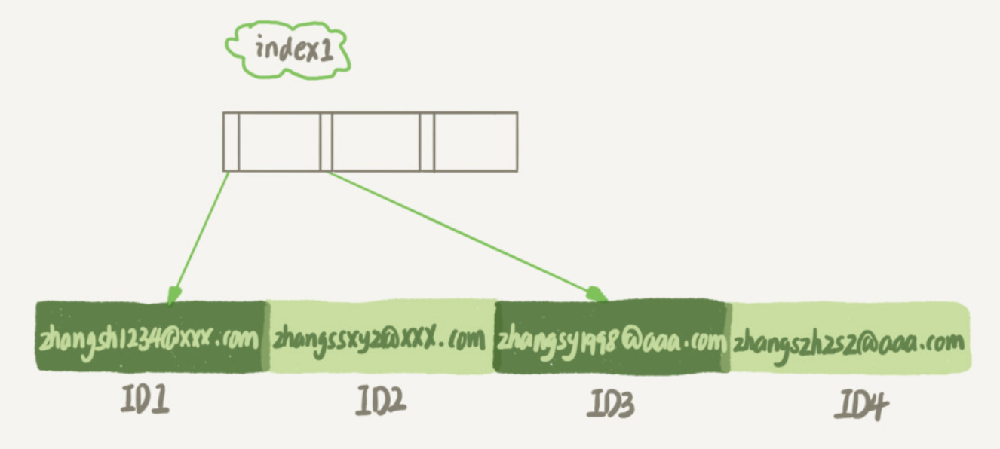
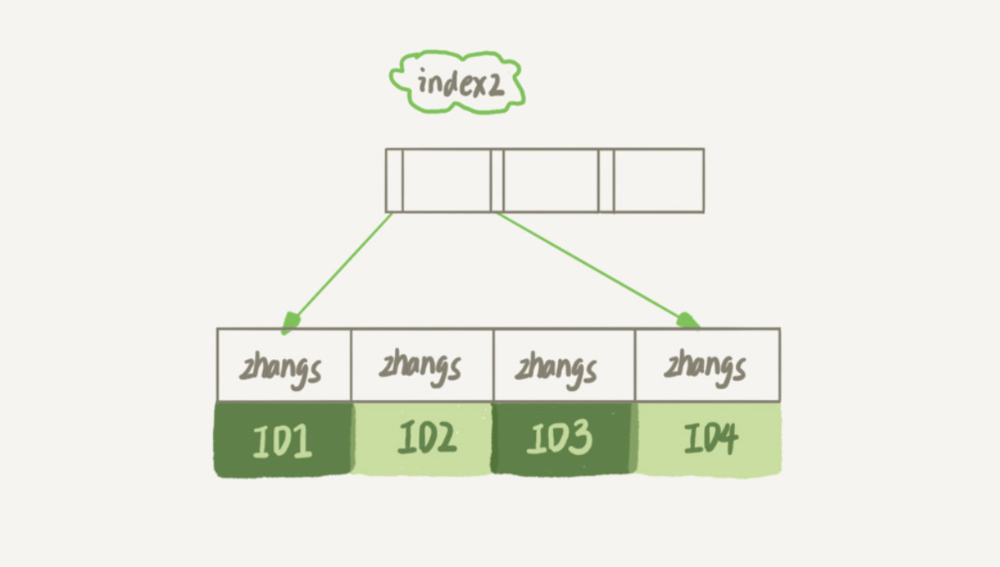

## 1、字符串索引

假设，你现在维护一个支持邮箱登录的系统，用户表是这么定义的
```shell 
mysql> create table SUser(
ID bigint unsigned primary key,
email varchar(64), 
... 
)engine=innodb; 
```

要使用邮箱登录，一定会出现类似下面的语句：
```shell 
mysql> select f1, f2 from SUser where email='xxx';
```

email 这个字段上没有索引，那么这个语句就只能做全表扫描。

MySQL 是支持前缀索引的，你可以定义字符串的一部分作为索引，例如：
```shell 
mysql> alter table SUser add index index1(email);  ## 整个字符串
mysql> alter table SUser add index index2(email(6));  ## 前 6 个字节
```

两个索引图差别如下：






**使用前缀索引的优势，占用的空间会更小，但可能会增加额外的记录扫描次数。**

例如分析执行语句 `select id,name,email from SUser where email='zhangssxyz@xxx.com';` 的过程。

- 使用 index1 (整个字符串)：
<indent/>这个过程中，只需要从 index1 索引树找到满足索引值是 ’zhangssxyz@xxx.com’ 的这条记录，再进行**回表**操作，就可以返回结果。
 
- 使用 index2 (前 6 个字节)：
<indent/>这个过程中，需要从 index2 索引树找到满足索引值是 ’zhangs’ 的全部记录，再进行**回表**操作，逐一判断 email 是 ’zhangssxyz@xxx.com’，最后返回结果。可能有大量以 ’zhangs’ 开头的记录， 所以可能会增加额外的记录扫描次数。

**使用前缀索引，定义好长度，就可以做到既节省空间，又不用额外增加太多的查询成本。**

如果建立**前缀索引**，就要关注区分度，区分度越高越好。
可以使用如下语句，统计不同索引的个数：
```shell 
mysql> select count(distinct email) as L from SUser;
```

例如，统计 4~7 个字节的前缀索引：
```shell
mysql> select 
  count(distinct left(email,4)）as L4,
  count(distinct left(email,5)）as L5,
  count(distinct left(email,6)）as L6,
  count(distinct left(email,7)）as L7,
from SUser;
```

## 2、其他方式

对于类似于邮箱这样的字段来说，使用前缀索引的效果可能还不错,遇到前缀的区分度不够好的情况时，我们要怎么办呢？

例如对身份证号的解决方法。

- **第一种方式是使用倒序存储。**
```shell script
mysql> select field_list from t where id_card = reverse('input_id_card_string');
```

- **第二种方式是使用hash字段**
```shell script
## 添加索引，用来存储 crc32。
mysql> alter table t add id_card_crc int unsigned, add index(id_card_crc);
# 查询时判断 crc32 值
mysql> select field_list from t where id_card_crc=crc32('input_id_card_string') and id_card='input_id_card_string'
```

**它们的相同点是，都不支持范围查询。**

## 3、问题

如果你在维护一个学校的学生信息数据库，学生登录名的统一格式是 ”学号@gmail.com", 而学号的规则是：十五位的数字，其中前三位是所在城市编号、第四到第六位是学校编号、第七位到第十位是入学年份、最后五位是顺序编号。

系统登录的时候都需要学生输入登录名和密码，验证正确后才能继续使用系统。就只考虑登录验证这个行为的话，你会怎么设计这个登录名的索引呢？


答案：

可以只存入学年份加顺序编号，它们的长度是 9 位。如果数字类型来存这 9 位数字。比如 201100001 ，这样只需要占 4 个字节。
