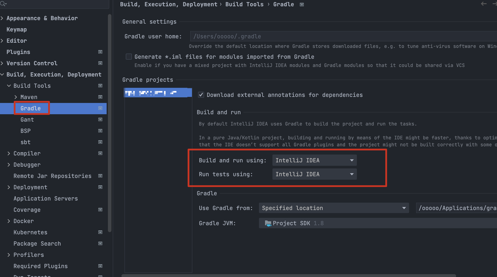

### 1. idea gradle project show duplicated file tree（project view and packages view）

you must select **idea** as run **test** and **building**

refer:

1. [jetbrains idea gradle tool window](https://www.jetbrains.com/help/idea/jetgradle-tool-window.html#gradle_toolbar)
