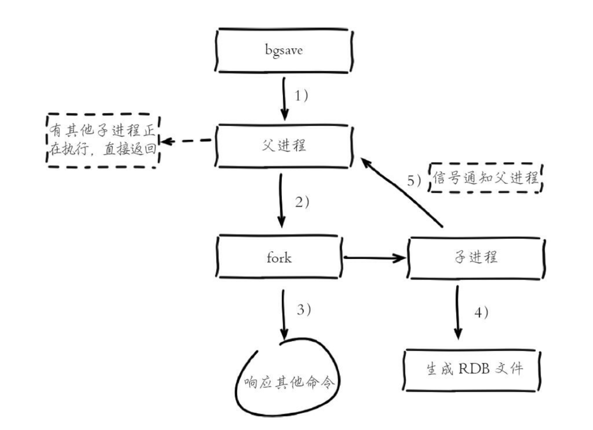
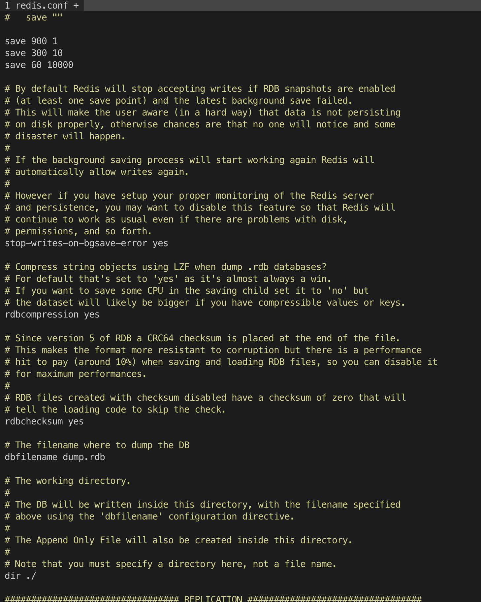

## 1、RDB

### 1、触发机制

手动触发，分别有 `save` 和 `bgsave` 两个命令。
- `save`： 会阻塞当前 Redis 服务器，直到 RDB 过程完成为止，不建议使用。
- `bgsave`： Redis 进程会 **fork** 出子进程，子进程进行 RDB 持久化，阻塞只会发生在 **fork** 阶段。

自动触发的场景：
- `save m n` 配置，表示在 m 秒中存在 n 次数据改变，才会触发 `bgsave`。
- 从节点全量复制过程中，主节点会执行 `bgsave` 生成 RDB 文件，发送子节点。
- 默认关闭情况下，如果没有开启 AOF，也会执行 `bgsave`。

### 2、触发流程

`bgsave` 命令的运行流程如下图：

说明；
1. 执行 `bgsave` 命令， 判断是否有 AOF/RDB 进程。
2. 执行 `info stats` 命令，选项 `latest_fork_usec` 表示最后一次 fork 使用的秒数。
3. `bgsave` 命令执行完成后，会出现 **Background saving started** 提示。 
4. 子进程创建 RDB 文件成功后，对原有的文件进行原子替换, 执行 `lastsave` 命令获取最后一次生成 RDB 文件的时间，对应 `info Persistence` 命令中的选项 `rdb_last_save_time`。

### 3、RDB 文件的处理

- RDB 文件通过配置文件参数 `dbfilename` 和 `dir`来配置，也可以通过命令 `config set dir {dir}` 和 `config set dbfilename {dbfilename}` 来动态配置。
- RDB 文件默认采用 **LZF** 压缩，通常建议开启，因为主从复制时，需要发送 RDB 文件到从节点，这样可以节省带宽。
- RDB 默认也开启校验，可以通过脚本 `redis-check-rdb` 来校验生成相应的错误报告。

### 4、RDB 的优缺点

优点：
- RDB 非常适合备份、全量复制等场景，比如每 6 小时定时执行 `bgsave`，可用于灾难恢复。
- RDB 的恢复数据远远快于 AOF 方式。

缺点：
- RDB 无法做到秒级持久化，fork 创建子进程也属于重量级操作。
- RDB 用特定的二进制格式保存，可能有版本不兼容问题。

## 2、AOF
## 3、问题定位与优化
## 4、多实例部署
