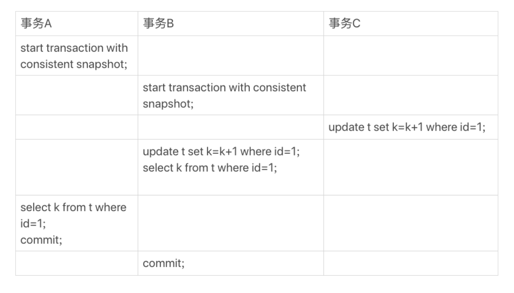
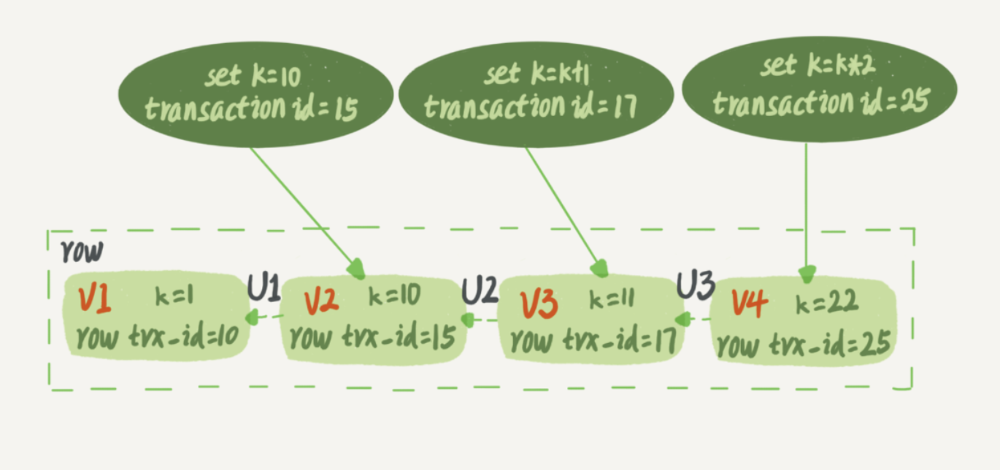
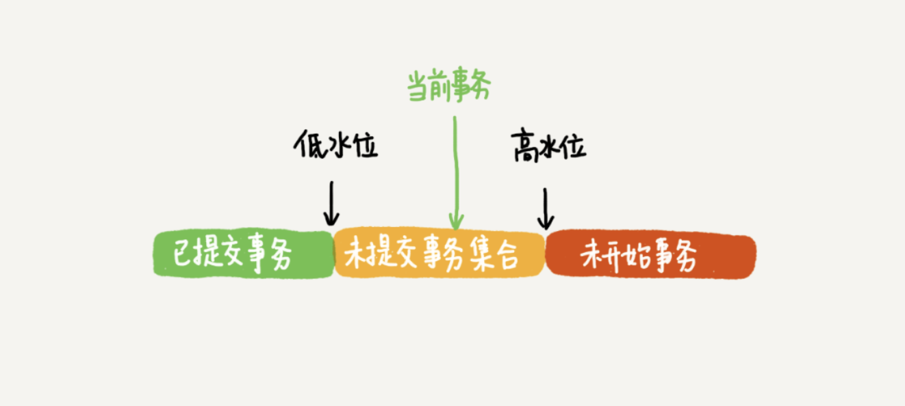
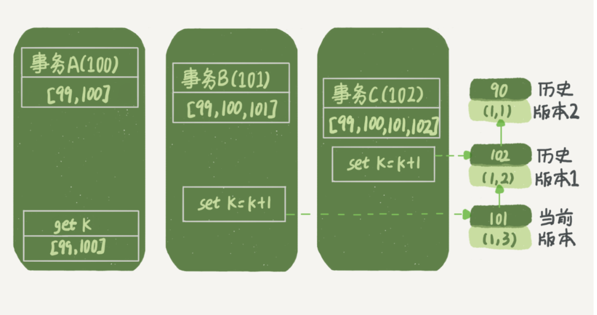
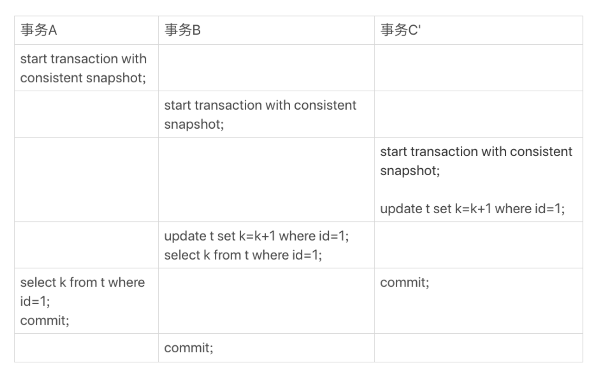
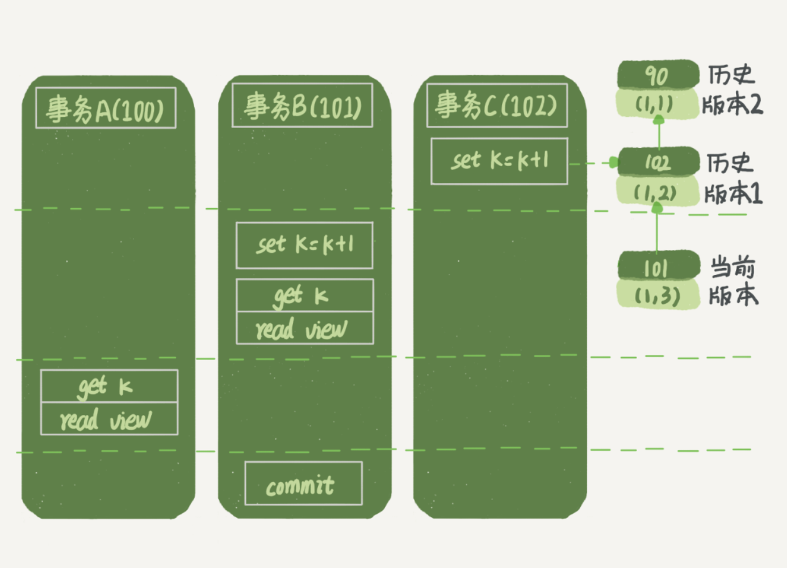
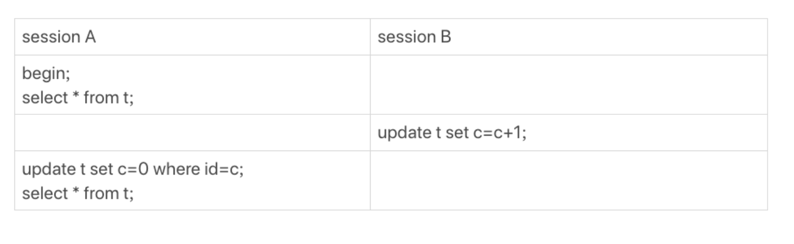
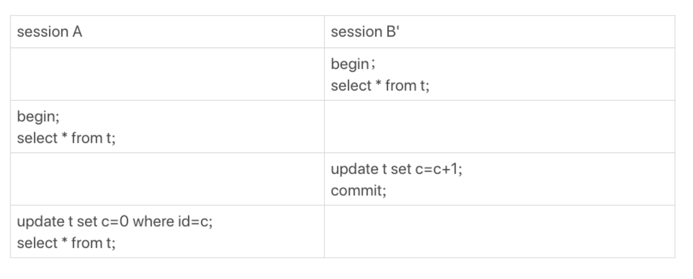

## 1、事务

> 在[第 3 篇](./03.md)文章和你讲事务隔离级别的时候提到过，如果是可重复读隔离级别，事务 T 启动的时候会创建一个视图 read-view，之后事务 T 执行期间，即使有其他事务修改了数据，事务 T 看到的仍然跟在启动时看到的一样。

例子：
```shell script
mysql> CREATE TABLE `t` (
  `id` int(11) NOT NULL,
  `k` int(11) DEFAULT NULL,
  PRIMARY KEY (`id`)
) ENGINE=InnoDB;
insert into t(id, k) values(1,1),(2,2);
```



在可重复读隔离级别下，`begin/start transaction` 并不是事务的起点，只有执行到第一个语句时才会真正启动事务。如果你想要马上启动一个事务，可以使用 `start transaction with consistent snapshot` 这个命令。
 
在这个例子中，事务 C 没有显式地使用 `begin/commit` ，表示这个 update 语句本身就是一个事务，语句完成的时候会自动提交。

**结果是事务 B 的 k 值为 3，事务A的 k 值为 1。**

在 MySQL 里，有两个"视图"的概念:
- 一个是 view，它是一个用查询语句定义的虚拟表。
- 另一个是 InnoDB 在实现 MVCC 时用到的一致性读视图，即 consistent read view。

## 2、"快照"怎么工作的

在可重复读隔离级别下，事务在启动的时候就"拍了个快照"。这个快照是基于整库的。

InnoDB 里面每个事务有一个唯一的事务 ID，叫作 **transaction id** 。它是在事务开始的时候向 InnoDB 的事务系统申请的，是按申请顺序严格递增的。

而每行数据也都是有多个版本的。每次事务更新数据的时候，都会生成一个新的数据版本，并且把**transaction id**赋值给这个数据版本的事务 ID，记为 **row trx_id**。也就是说，表中的一行记录，其实可能有多个版本(row)，每个版本有自己的 **row trx_id**。

一个记录被多个事务连续更新后的状态:



图中虚线框里是同一行数据的4个版本，当前最新版本是 V4，k 的值是 22，它是被**transaction id** 为 25 的事务更新的，因此它的 **row trx_id** 也是 25。

图中三个虚线箭头，就是 **undo log**，而 V1、V2、V3 并不是物理上真实存在的，而是每次需要的时候根据当前版本和 **undo log** 计算出来的。

一个事务只需要在启动的时候声明说，"以我启动的时刻为准，如果一个数据版本是在我启动之前生成的，就认；如果是我启动以后才生成的，我就不认，我必须要找到它的上一个版本"。如果"上一个版本"也不可见，那就得继续往前找。

在实现上， InnoDB 为每个事务构造了一个数组，用来保存这个事务启动瞬间，当前正在 **活跃** (启动了但还没提交)的所有事务 ID。

**数组里面事务 ID 的最小值记为低水位，当前系统里面已经创建过的事务 ID 的最大值加1记为高水位。**



对于一个数据版本的 row trx_id, 有以下几种可能：

- 如果落在绿色部分，表示这个版本是已提交的事务或者是当前事务自己生成的，这个数据是可见的；

- 如果落在红色部分，表示这个版本是由将来启动的事务生成的，是肯定不可见的；

- 如果落在黄色部分，那就包括两种情况

    a. 若 row trx_id 在数组中，表示这个版本是由还没提交的事务生成的，不可见；

    b. 若 row trx_id 不在数组中，表示这个版本是已经提交了的事务生成的，可见。

分析下图 1 中的三个事务，事务 A 为什么是 k=1 ？

假设：
1. 事务A开始前，系统里面只有一个活跃事务 ID 是 99；
2. 事务 A、B、C 的版本号分别是 100、101、102，且当前系统里只有这四个事务；
3. 三个事务开始前，(1,1）这一行数据的 row trx_id是 90。

这样，事务 A 的视图数组就是 \[99,100] , 事务B的视图数组是 \[99,100,101], 事务C的视图数组是 \[99,100,101,102]。

事务A查询逻辑有关的操作:



总结：

一个数据版本，对于一个事务视图来说，除了自己的更新总是可见以外，有三种情况：
- 版本未提交，不可见；
- 版本已提交，但是是在视图创建后提交的，不可见；
- 版本已提交，而且是在视图创建前提交的，可见。

### 3、更新逻辑

**更新数据都是先读后写的，而这个读，只能读当前的值，称为"当前读"（current read）**。

在执行事务 B 语句的时候，update 语句是**当前读**，这是 row trx_id 为 101，所以 select 语句能读到 k=3。

**除了 update 语句外，select 语句如果加锁，也是当前读。**
```shell script
mysql> select k from t where id=1 lock in share mode; # 读锁（S锁，共享锁）
mysql> select k from t where id=1 for update; # 写锁（X锁，排他锁）
```

假设事务 C 不是马上提交的，而是变成了下面的事务 C’，会怎么样呢？



事务 C’ 没提交，也就是说 (1,2) 这个版本上的写锁还没释放。而事务B 是当前读，必须要读最新版本，而且必须加锁，因此就被锁住了，必须等到事务 C’ 释放这个锁，才能继续它的当前读。

总结：

可重复读的核心就是一致性读（consistent read）；而事务更新数据的时候，只能用当前读。如果当前的记录的行锁被其他事务占用的话，就需要进入锁等待。

读提交的逻辑和可重复读的逻辑类似，它们最主要的区别是：
- 在可重复读隔离级别下，只需要在事务开始的时候创建一致性视图，之后事务里的其他查询都共用这个一致性视图；
- 在读提交隔离级别下，每一个语句执行前都会重新算出一个新的视图。

注意，语句 `start transaction with consistent snapshot;` 在读提交隔离级别下，没有意义。

读提交时的状态图，注意是事务 C。



事务 A 查询语句返回的是 k=2，事务 B 查询结果 k=3。


## 4、最重要的总结

一个数据版本，对于一个事务视图来说，除了自己的更新总是可见以外，有三种情况：

- 版本未提交，不可见；
- 版本已提交，但是是在视图创建后提交的，不可见；
- 版本已提交，而且是在视图创建前提交的，可见。

语句 `update` 、`for update` 、`lock in share mode` 是**当前读**。

## 5、问题

我用下面的表结构和初始化语句作为试验环境，事务隔离级别是可重复读。现在，我要把所有"字段c和id值相等的行"的 c 值清零，但是却发现了一个“诡异”的、改不掉的情况。请你构造出这种情况，并说明其原理。
```shell script
mysql> CREATE TABLE `t` (
  `id` int(11) NOT NULL,
  `c` int(11) DEFAULT NULL,
  PRIMARY KEY (`id`)
) ENGINE=InnoDB;
insert into t(id, c) values(1,1),(2,2),(3,3),(4,4);
```

出现的情况：


1. 第一种情况



2. 第二种情况


